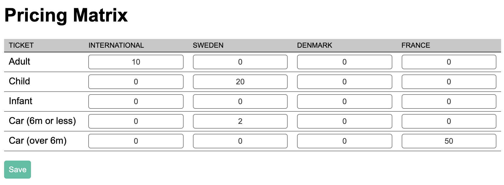

 # Ticknovate Front End Developer Test

This task is a test to demonstrate skills with React.js and state manipulation using an existing codebase.

## Task

Build a UI to manipulate an array of price values.



Use the provided components and data hooks to achieve this.

### Setup

To get started, install the dependencies and start the development server:

```sh
npm install
npm start
```

Then, view the project in your browser at http://localhost:3000/ and start making your changes in [src/App.js](src/App.js).

### Task details

Build a UI to manipulate values using a supplied data model.

The UI is to be built using existing components supplied in the repository along with a set of hooks that will supply mock data.

The UI should take the form of a Matrix or Data Table.

The X axis of the UI should be generated from data returned by the `useMarkets` hook, which returns an array of Market values. The Y axis should be generated by data returned from the `useTickets` hook, which returns an array of Ticket values.

The `useData` hook returns an array of data representing the desired data shape, mocking an existing record. Using this data, make the UI as shown in the example above, and enable the values to reflect a change to any of the values in the cells.

Upon pressing the ‘Save’ button, send only data that has a non-zero value.

### Structure and Components

```
/App.js
/components
  /action
    /ActionCTA
  /input
    /InputInteger
  /layout
    /Heading
    /Table
    /View
/hooks
  /useData
  /useMarkets
  /useTickets
```

#### Hooks
*(/hooks/)*

Three hooks are provided, `useData`, `useMarkets` and `useTickets`. Each of these returns the same shape `{ isLoaded: Boolean, data: Array }` where data is the response from the mock call and isLoaded reflects whether the data has finished loading.
The first hook `useData` returns a representation of the current record:

```
[
  {
    ticket_id: 'adult',
    market_id: 'int',
    value: 10
  },
  ...
]
```

This is the expected shape of data that you will return for the purposes of the test. The second hook (`useMarkets`) returns a list of markets:

```
[
  {
    market_id: 'fr',
    title: 'France'
  },
  ...
]
```

This data will be used for the X axis of the component. The last hook (`useTickets`), returns a list of tickets that will be used for the Y axis of the component:

```
[
  {
    ticket_id: 'child',
    title: 'Child'
  },
  ...
]
```

#### Components
*(/components/)*

The components used in the example (`Table`, `InputInteger`, `ActionCTA`) can all be found in the components folder.

## Task Acceptance Criteria
- Demonstrate the ability to use existing components
- Consume data from supplied data hooks
- Create an interface that can manipulate multi-dimensional data
- Demonstrate the ability to save only valid data
- Write easy to understand and cleanly formatted code
